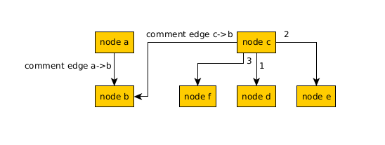

Call Tree Builder

This project is mainly for converting call tree graphs described in [CCTree](https://github.com/hari-rangarajan/CCTree/) format, into .dot format.

One useful usecase:
- Collect several call tree graphs generated by CCTree vim plugin, put them into one file `graph.cct`
- Convert to .dot: run `build_call_tree.py <path/to/graph.cct> <path/to/graph.dot>`.
- Convert to .gml (via graphviz): run `gv2gml <path/to/graph.dot> -o <path/to/graph.gml>`.
- Load .gml file in [yEd](https://www.yworks.com/products/yed).
- In yEd go to `Ctrl+A -> Tools -> Fit node to label`, then `Layout -> Hierarchical`
Now your can move nodes as you like and create some useful painted call graphs.

Example cctree graph:

()
```
+-> node a
  +-> node b # comment edge a->b

+-< node b
  +-< node c # comment edge c->b

+-> node c
  +-> node d #1
  +-> node e #2
  +-> node f #3

+-> A #
  +-> if (condition) # shape=ellipse
    +-> B # true
    +-> C # false
```

Example gml visualization in yEd:


